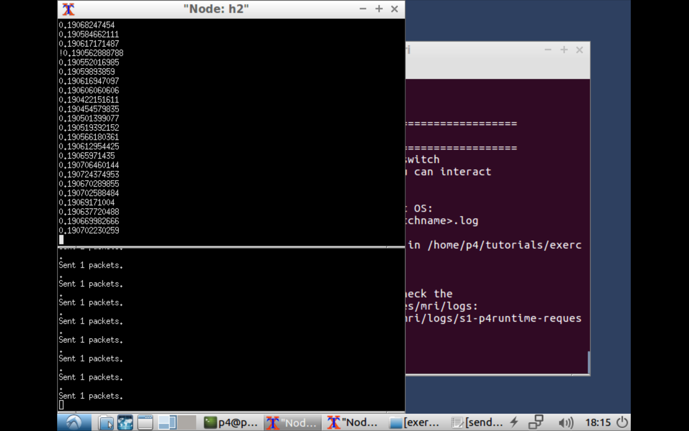

**LossSight-FindINT**

A packet loss detection and location solution based on AM-PM and INT, suitable for Mininet environment, written in P4 language.

The topology in Mininet is h1-s1-s2-h2. Although there are s3 and h3 in the topology, they are only used to create network congestion. If you only need to detect packet loss, you do not need to use s3 and h3.

In this topology, we simulate random network packet loss by setting the link: s1-s2 packet loss rate. The packet loss rate is 0.1%, 0.3%, 0.5%, 1%, 5%, and 10%. Simulate congestion and packet loss through H3 iperf H2 (UDP).

FindINT supports two encoding methods of Loss_Bit:

（1）SAM, Single-Bit Alternate Marking

For example, when the alternate period is 6, the INT Source Node marks the arriving telemetry data packets according to the rule of "0 0 0 1 1 1 0 0 0 1 1 1 ...".

（2）MCM, multi-bit cycle mark

For example, when the length of Loss_Bit is 2, INT Source Node marks the arriving telemetry data packets according to the rule of "00 01 10 11 00 01 10 11 ...".

By marking point by point, FindINT supports packet loss location.

How to use FindINT:

1. Install P4-Tutorial mirror, recommend https://github.com/p4lang/tutorials/

2. Find the /usr/local/share/p4c/p4include/v1model.p4 file and find:
     
     void read(out T result, in bit<32> index);

Add a line before this line:     

     register(bit<32> size, T initial_value);

The effect is as follows:

     *              ignored by the caller.
     */
    register(bit<32> size, T initial_value);
    void read(out T result, in bit<32> index);
    /***
     * write() writes the state of the register array at the specified
     * index, with the value provided by the value parameter.
     
3. Unzip FindINT into the exercises folder and enter FindINT.
4. Execute Make in the terminal.
5. Test
     h1 ping h2
And successfully pinged.

6. Open the terminal
    
    xterm h1 h2
    
7. Execute in H2
    
    ./receive.py
    
8. Execute in H1

    ./send.py 10.0.2.2 "123" 100000
     
100000 is the number of INT packets.

9. The packet loss rate measurement result is observed in H2.

The current version only announces packet loss detection. If you need to locate the packet loss, you need to have two lossbits in the packet, s1 fills lossbit[0], and s2 fills lossbit[1].

# 中文简介

**LossSight-FindINT**

我们在Mininet的拓扑是h1 - s1 - s2 - h2。尽管拓扑中有s3和h3，但是它们仅仅是为了制造网络拥塞使用的。如果只需要检测丢包，则不需要使用s3和h3。

在这个拓扑中，我们通过设置link：s1 - s2的丢包率模拟网络随机丢包，丢包率为0.1%，0.3%，0.5%，1%，5%，10%。通过H3 iperf H2模拟拥塞丢包。

LossSight-FindINT支持两种丢包位（Loss_Bit）编码方式：

（1）SAM，单Bit交替标记

例如，交替周期为6时，INT Source Node 按照“0 0 0 1 1 1 0 0 0 1 1 1 ...”的规律标记到达的遥测数据包。

（2）MCM，多Bit循环标记

例如，Loss_Bit长度为2时，INT Source Node 按照“00 01 10 11 00 01 10 11 ...”的规律标记到达的遥测数据包。
通过逐点标记，FindINT支持丢包定位。

使用方式：

1.安装P4-Tutorial镜像，推荐https://github.com/p4lang/tutorials/

2.找到/usr/local/share/p4c/p4include/v1model.p4文件，找到：
     
     void read(out T result, in bit<32> index);

在该行前面添加一行：     
     
     register(bit<32> size, T initial_value);

效果如下：

     *              ignored by the caller.
     */
    register(bit<32> size, T initial_value);
    void read(out T result, in bit<32> index);
    /***
     * write() writes the state of the register array at the specified
     * index, with the value provided by the value parameter.

3.将FindINT解压到exercises文件夹中，并进入FindINT。

4.在终端中执行Make。

5.测试 

     h1 ping h2

并成功ping通。

6.打开终端

     xterm h1 h2

7.在H2中执行

     ./receive.py

8.在H1中执行

     ./send.py 10.0.2.2 "123" 100000
     
其中100000是INT数据包数量。

9.在H2中观察到丢包率测量结果。

目前的版本只公布了检测丢包。如果你需要定位丢包，那么需要在packet中有两个lossbit，s1填充lossbit[0],s2填充lossbit[1]即可。
