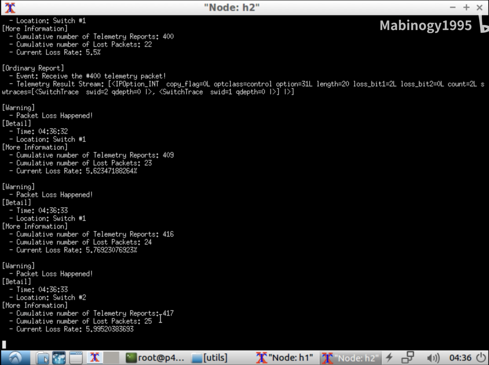

# LossSight

LossSight is a complete system for in-band network telemetry packet loss detection, localization, diagnosis and recovery.

（1）LossSight-FindINT is LossSight based on Mininet+P4.

（2）LossSight-DataSet is a partial telemetry result data set.

（3）LossSight-GAN is a missing data completion component for in-band network telemetry based on a generative adversarial network.

Demo Video: https://www.bilibili.com/video/BV1CV411j7AX/   https://www.bilibili.com/video/BV1yv411t7G1

**LossSight-FindINT**

A packet loss detection and location solution based on AM-PM and INT, suitable for Mininet environment, written in P4 language.

FindINT supports two encoding methods of Loss_Bit:

（1）SAM, Single-Bit Alternate Marking

For example, when the alternate period is 6, the INT Source Node marks the arriving telemetry data packets according to the rule of "0 0 0 1 1 1 0 0 0 1 1 1 ...".

（2）MCM, multi-bit cycle mark

For example, when the length of Loss_Bit is 2, INT Source Node marks the arriving telemetry data packets according to the rule of "00 01 10 11 00 01 10 11 ...".

By marking point by point, FindINT supports packet loss location.

How to use FindINT:

1. Install P4-Tutorial mirror, recommend https://github.com/p4lang/tutorials/

2. Find the /usr/local/share/p4c/p4include/v1model.p4 file and find:
     
     void read(out T result, in bit<32> index);

Add a line before this line:     

     register(bit<32> size, T initial_value);

The effect is as follows:

     *              ignored by the caller.
     */
    register(bit<32> size, T initial_value);
    void read(out T result, in bit<32> index);
    /***
     * write() writes the state of the register array at the specified
     * index, with the value provided by the value parameter.
     
3. Unzip FindINT into the exercises folder and enter FindINT.
4. Execute Make in the terminal.
5. Test
     h1 ping h2
And successfully pinged.

6. Open the terminal
    
    xterm h1 h2
    
7. Execute in H2
    
    ./receive.py
    
8. Execute in H1

    ./send.py 10.0.2.2 "123" 100000
     
100000 is the number of INT packets.

9. The packet loss rate measurement result is observed in H2.

**LossSight-DataSet**

A dataset on in-band network telemetry packet loss, tracking the long-term statistical results of two edge switches in Fat-Tree Network, including random loss (0.1%, 0.5%, and 1% three different random packet loss probabilities), congestion loss and blackhole loss.

Most file contains 100,000 pieces of INT Telemetry data. However, due to packet loss, the actual data volume is less than 100,000 rows, and the missing is the packet loss. each row contains 1 telemetry data, and contains two hops of telemetry results. The telemetry packet loss marking scheme uses MCM=8.

The file format of each line is:[INT Report TimeStamp] [Loss Bit] [SwitchID #1] [Qdepth #1] [SwitchID #2] [Qdepth #2]

**LossSight-GAN**

    $ python3 LossSight_GAN.py --data_name LossSight --batch_size 128 --hint_rate 0.9 --alpha 100 --iterations 10000

# 中文简介

LossSight-FindINT为基于P4 Tutorial实现的LossSight。

LossSight-DataSet为部分遥测结果数据集。

LossSight-GAN是基于生成对抗网络实现的带内网络遥测缺失数据补全组件。

**LossSight-FindINT**

LossSight-FindINT支持两种丢包位（Loss_Bit）编码方式：

（1）SAM，单Bit交替标记

例如，交替周期为6时，INT Source Node 按照“0 0 0 1 1 1 0 0 0 1 1 1 ...”的规律标记到达的遥测数据包。

（2）MCM，多Bit循环标记

例如，Loss_Bit长度为2时，INT Source Node 按照“00 01 10 11 00 01 10 11 ...”的规律标记到达的遥测数据包。
通过逐点标记，FindINT支持丢包定位。

使用方式：

1.安装P4-Tutorial镜像，推荐https://github.com/p4lang/tutorials/

2.找到/usr/local/share/p4c/p4include/v1model.p4文件，找到：
     
     void read(out T result, in bit<32> index);

在该行前面添加一行：     
     
     register(bit<32> size, T initial_value);

效果如下：

     *              ignored by the caller.
     */
    register(bit<32> size, T initial_value);
    void read(out T result, in bit<32> index);
    /***
     * write() writes the state of the register array at the specified
     * index, with the value provided by the value parameter.

3.将FindINT解压到exercises文件夹中，并进入FindINT。

4.在终端中执行Make。

5.测试 

     h1 ping h2

并成功ping通。

6.打开终端

     xterm h1 h2

7.在H2中执行

     ./receive.py

8.在H1中执行

     ./send.py 10.0.2.2 "123" 100000
     
其中100000是INT数据包数量。

9.在H2中观察到丢包率测量结果。

**LossSight-DataSet**

一个带内网络遥测丢包数据集，在Fat-Tree网络中跟踪两个边缘交换机的长时间的统计结果，包含随机缺失（0.1%、0.5%、1%多种不同的随机丢包概率）、拥塞缺失、黑洞缺失等多种丢包类型。

大多数文件应包含100000条数据，但由于丢包原因，实际数据量小于100000行，缺失数据即为丢包数据。每一行为1个遥测数据，包含两跳的遥测结果。遥测丢包标记方案采用MCM=8。

每行的文件格式为：[INT Report时间戳] [Loss Bit] [SwitchID #1] [队列长度 #1] [SwitchID #2] [队列长度 #2]

**LossSight-GAN**

    $ python3 LossSight_GAN.py --data_name LossSight --batch_size 128 --hint_rate 0.9 --alpha 100 --iterations 10000

